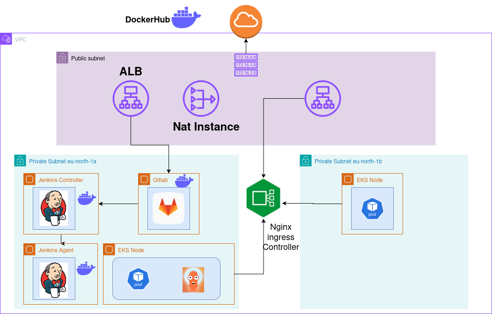

# Bank Leumi CI/CD Project

## Overview

This project automates the infrastructure provisioning and deployment processes for Bank Leumi using **Terraform**, **Jenkins**, and **GitLab**. The goal is to create a seamless CI/CD pipeline that integrates code changes from GitLab, triggers builds in Jenkins, and deploys applications to an AWS EKS cluster.

## Infrastructure Automation

### Terraform Setup

We utilize Terraform to automate the creation of the following AWS resources:

- **VPC**: A Virtual Private Cloud to host our resources securely.
- **Subnets**: Private subnets for Jenkins and GitLab, ensuring they are not exposed directly to the internet.
- **Application Load Balancer (ALB)**: To manage incoming traffic to our services.
- **EKS Cluster**: An Elastic Kubernetes Service cluster for deploying containerized applications.
- **Network Load Balancer (NLB)**: For handling high-throughput traffic.
- **Test EC2 Instances**: To validate our infrastructure setup.

The Terraform configuration is modularized for reusability and dynamic configuration, allowing easy adjustments to parameters like instance types, regions, and scaling options.

## CI/CD Pipeline

### Jenkins Integration

The CI/CD pipeline is implemented in Jenkins, which is triggered by changes in the GitLab repository. The pipeline consists of several stages:

1. **Checkout SCM**: Pulls the latest code from the GitLab repository.
2. **Debug ArgoCD CLI**: Checks if the ArgoCD CLI is installed and accessible.
3. **Setup ArgoCD and NGINX Ingress Controller**:
   - Updates kubeconfig for EKS.
   - Deploys the NGINX Ingress Controller.
   - Installs ArgoCD in a dedicated namespace.
   - Configures SSL passthrough for secure connections.
4. **Install ArgoCD CLI**: Downloads and installs the ArgoCD command-line interface.
5. **Login to ArgoCD and Create Application**:
   - Retrieves the initial admin password from ArgoCD secrets.
   - Logs into ArgoCD using the CLI.
   - Creates an application in ArgoCD that points to the GitLab repository for deployment.
6. **Update Deployment in ArgoCD Repo**:
   - Updates the `values.yaml` file with the current Docker image tag based on the latest build.
   - Commits and pushes changes back to the GitLab repository.

### Continuous Integration

When a change is made in GitLab, Jenkins automatically triggers a CI job that performs static analysis on the code using tools like Bandit and Pylint. If all checks pass, Jenkins builds a Docker image and pushes it to Docker Hub.

### Continuous Deployment

After building the Docker image, Jenkins triggers another job that handles:

- Setting up the NGINX Ingress Controller if not already deployed.
- Deploying ArgoCD for managing application deployments in Kubernetes.
- Synchronizing application states in Kubernetes using ArgoCD.

## DNS Configuration with Route 53

To enable secure access to ArgoCD and deployed applications, we configure DNS records using AWS Route 53:

- An A record is created for `argocd.stockpnl.com`, pointing to the NGINX Ingress Controller's DNS name, allowing HTTPS access.

## Conclusion

This project demonstrates a complete CI/CD workflow from infrastructure provisioning to application deployment on AWS using modern DevOps practices. By leveraging Terraform for infrastructure as code, Jenkins for continuous integration, and GitLab for version control, we achieve a streamlined process that enhances productivity and reliability.

## Future Work

Future enhancements may include:

- Implementing additional monitoring and logging solutions.
- Expanding automated tests within the CI pipeline.
- Integrating additional services or microservices into the existing architecture.

