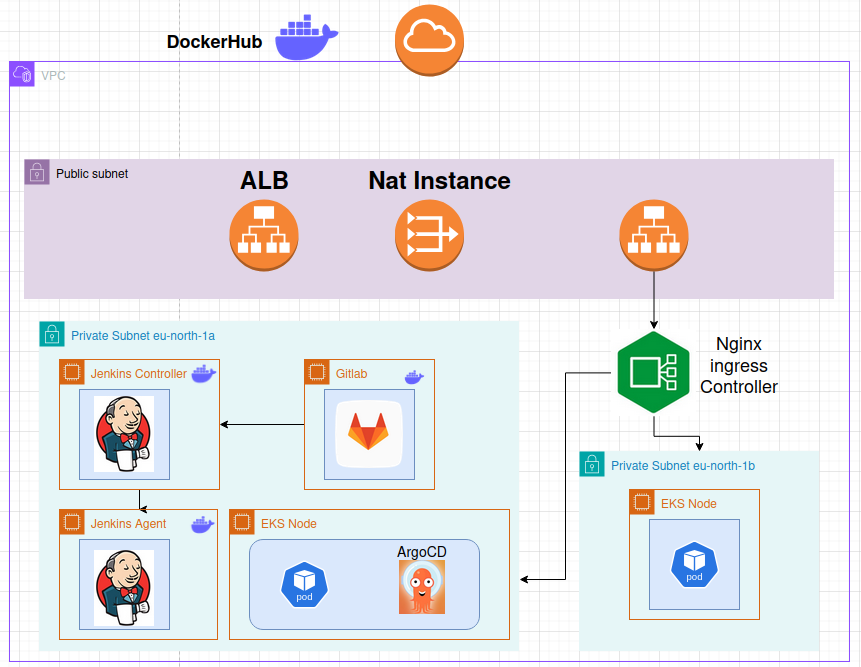

# Bank Leumi CI/CD Project

## Overview

### This project sets up automated infrastructure and deployment using Terraform, Jenkins, and GitLab, with a CI/CD pipeline to build and deploy applications to an AWS EKS cluster

## Infrastructure Automation

### Terraform Setup

Utilization of Terraform to automate the creation of the following AWS resources using modularized configurations:

#### `vpc_setup_root`
- Sets up the VPC with 2 private and 2 public subnets.
- Configures a NAT instance for internet access from private subnets.

#### `jenkins_alb_root`
- Deploys Jenkins and GitLab EC2 instances in private subnets.
- Sets up an Application Load Balancer (ALB) with target groups pointing to the Jenkins and GitLab instances.

#### `eks_setup_root`
- Configures the Elastic Kubernetes Service (EKS) cluster for deploying containerized applications.

#### `test_ec2_root`
- Sets up a test EC2 instance running Apache.
- Connects the instance to a Network Load Balancer (NLB) with an Elastic IP.
- Configures access to the EC2 instance to be restricted to IP `91.231.246.50/32`.

### Continuous Integration and Deployment

#### CI/CD Workflow

1. **CI Pipeline**:
    - Jenkins pipeline runs tests on the application code.
    - Builds a Docker image of the application and pushes it to Docker Hub.

2. **CD Pipeline**:
    - After the CI job finishes, a CD Jenkins job is triggered.
    - Updates the build number in the `values.yaml` file in a separate GitLab repository where the Kubernetes manifests are stored.
    - Deploys ArgoCD and the NGINX Ingress Controller in the EKS cluster.

3. **ArgoCD Sync**:
    - ArgoCD automatically syncs changes from the updated `values.yaml` file to the EKS cluster.

---

## DNS Configuration with Route 53

To enable secure access to ArgoCD and deployed applications, the following DNS configuration was performed:

- An A record was created for `stockpnl.com` to route traffic to the Python application running on EKS pods. This traffic is routed through the AWS Elastic Load Balancer (ELB) to the NGINX ingress controller, which forwards it to the application backend.
- An A record was created for `argocd.stockpnl.com` to route traffic to the ArgoCD server through the ELB. The NGINX ingress controller handles routing to the ArgoCD server.

### How It Works

1. **DNS Resolution**:
    - Users accessing `stockpnl.com` or `argocd.stockpnl.com` are directed to the ELB via Route 53 DNS records.

2. **Traffic Flow**:
    - The ELB receives incoming traffic and forwards it to the NGINX ingress controller running in the Kubernetes cluster.
    - The ingress controller routes traffic based on the Ingress resources:
        - `stockpnl.com` routes to the Python application (HTTPS is terminated at the ELB).
        - `argocd.stockpnl.com` routes to the ArgoCD server (SSL passthrough to the backend).

This configuration ensures seamless and secure routing of traffic to the respective services.

---

## Features

- Automated infrastructure provisioning with Terraform.
- Integrated CI/CD pipeline for streamlined deployments.
- Secure private subnet configuration for Jenkins and GitLab.
- Scalable and reliable application deployment on AWS EKS.
- Modular Terraform configurations for reusability and flexibility.

---

## Improvements Needed

1. **Automating DNS Record Creation**:
   - Implement automation for creating DNS records in Route 53, dynamically associating an A record with the Load Balancer during the deployment process.

2. **Automating ArgoCD Application Setup**:
   - Integrate the creation of ArgoCD applications directly into the CI/CD pipeline to eliminate manual intervention and further streamline the deployment process.
